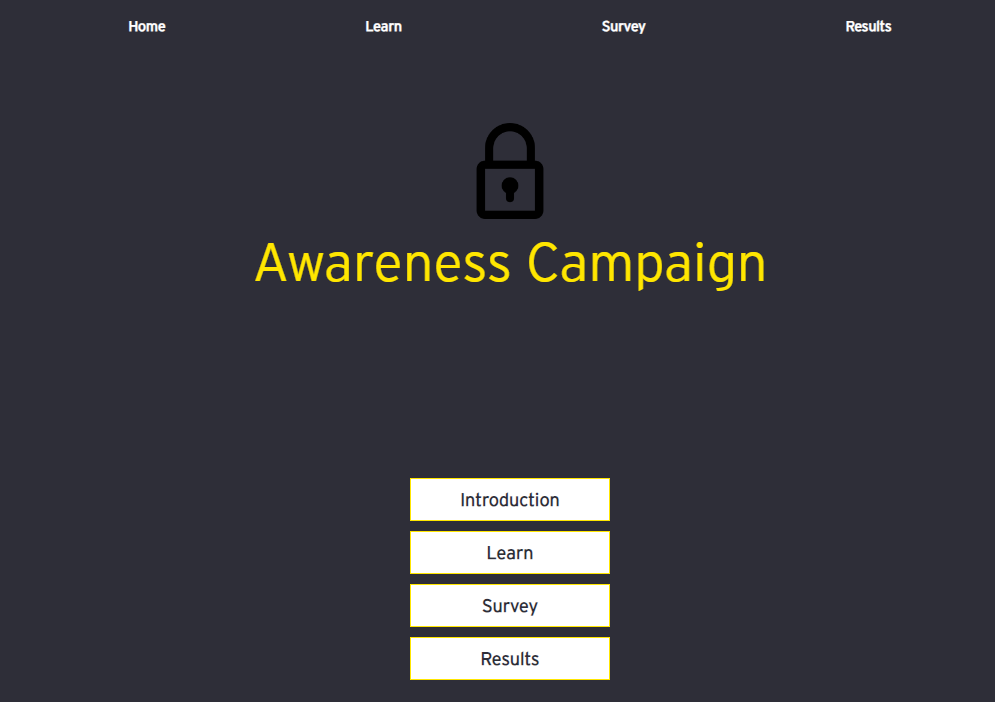

# Security Awareness Quiz Project

This project was developed during an internship to create an interactive quiz for employees to test their awareness level regarding security. The quiz provides multiple tests and examples where users can define and choose their security posture.

## Technologies Used
- React: Frontend framework for building the user interface.
- Firebase: Backend service for real-time database and user authentication.

## Features
- Interactive Quiz: Users can participate in a quiz to test their security awareness.
- Multiple Tests: The quiz offers various tests covering different aspects of security.
- Customizable Security Posture: Users can define and choose their security posture based on their preferences.
- Real-time Database: Utilizes Firebase for storing quiz data and user responses.
- User Authentication: Provides secure login functionality using Firebase authentication.

## How to Use
1. Clone the repository to your local machine.
2. Install dependencies using `npm install`.
3. Configure Firebase credentials in the project.
4. Run the project using `npm start`.
